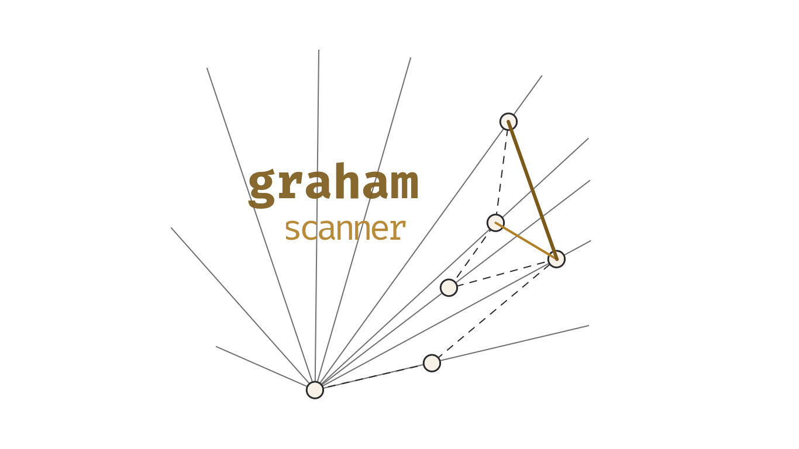

<div align="center">
  <picture>
    <source media="(prefers-color-scheme: dark)" srcset="./img/graham-scanner-dark.png">
    
  </picture>
</div>

Implements Graham's Scan for finding the convex hull of a set of 2D vertices.

Due to other packages no longer receiving new features&mdash;and buggy behaviour relating to vertices being collinear on the convex hull&mdash;this package has been created. This one should also be more computationally efficient, not using any \[inverse\] trigonometric functions.

## Installation

```
npm install graham-scanner
```

## Usage

```typescript
import GrahamScan from "graham-scanner";

const scan = new GrahamScan();
scan.setVertices([
  { x: 11.1, y: -0.3 },
  { x: -11.111, y: -0.3 },
  { x: 2, y: 1.2 },
  { x: -0.0055, y: 4 },
]);
const hull = scan.generateHull();
console.log(hull);
```

## Development Plans (the order is not particular)

- [ ] Increase variety of input/output data structures for the list of vertices for GrahamScanner&mdash; to not force conversion on the user side to/from `{ x: number, y: number }[]`.
- [x] Add options to change behaviour of the algorithm itself. Namely, whether or not to include collinear vertices in the hull, change the tolerance for floating point errors and potentially whether it walks counterclockwise or clockwise.
- [ ] There is currently a check in the algorithm for every vertex if they have the same polar angle from P0 to skip iterating through all but the farthest one. This potentially introduces more overhead than its worth for computational effiecieny, and should be checked to be removed.
- [ ] There is potential work to be done to increase numerical precision (for example from "[Classroom examples of robustness problems in
      geometric computations](https://inria.hal.science/file/index/docid/344310/filename/RevisedClassroomExamples.pdf)" by Lutz Kettner et al).
- [ ] There is potential to parallelize the algorithm using Web Workers. Starting references are the "All nearest smaller values" (ANSV) problem, which has a similar sequential implementation and a parallel algorithm ("Optimal doubly logarithmic parallel algorithms based on finding all nearest smaller values" by Berkman, Schieber & Vishkin, 1993) which uses a doubly logarithmic tree structure.

## Contribution Guidelines

Please feel free to contribute however you'd like! Open

- **Issues** for bug reports and feature requests
- **Pull Requests** for addressing bugs or adding features as per open issues.
